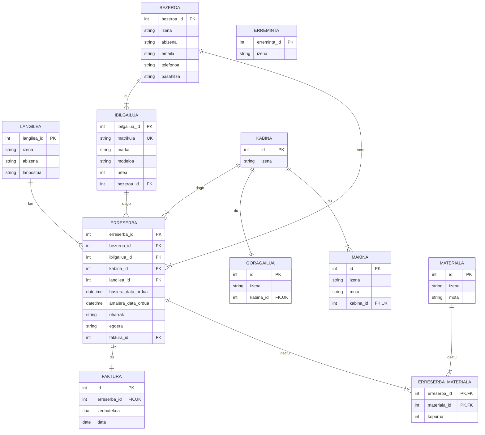

# DIY Garajea: Tailer Mekanikoaren Kudeaketa Sistema

## Lehenengo fasea

### 1. Ikuspegi Orokorra
DIY Garajearen proiektua, tailer mekaniko baterako kudeaketa sistema informatikoa da. Proiektuak bi alde nagusi ditu: Web aplikazioa eta Desktop aplikazioa.

### 2. Arkitektura Eredua: MVC Patroia (Model-View-Controller)
* Eredua (Model) geruza: MVC patroiaren Eredua geruza bi  modulutan banatuko da: garajea-model (datuen iraunkortasuna) eta garajea-core (Negozio Logika)

* Ikuspegia (View) eta Kontrolatzailea (Controller) geruzak: Modulu desberdinetan (Web eta Desktop) inplementatuko dira, eta modulu bakoitzak bere kontrolatzaileak eta bistak ditu. garajea-core moduluarekiko menepekotasuna dute.

* Proiektua egitura antolatu batean eraikitzeko Maven erabiltzen da. Arkitektura moduluanitza da:


Garajea modulua, proiektuaren modulu nagusia edo gurasoa da (edukiontzi bat), eta proiektu moduluanitzaren egitura orokorra definitzen du. Berez, karpeta batez eta pom.xml fitxategi batez osatzen da.

* Dena dela, moduluetan egituratutako kodeak zenbait menpekotasun ditu:


* Moduluak:
  - garajea-model: datuen iraunkortasunaz arduratzen da (DAO). Helburua, datuen iraunkortasuna negozio-logikatik banatzea da. Horrela, datuen iturburari (kasu honetan, MySQL) buruzko guztia (konexioa, datuen atzipena, etab) enkapsulatu egiten da. DAO-en erabileraren bitartez, ez da erakusten datu-base sistemaren xehetasunik (hala nola ResultSet delakoak, SQL kontsultak, etab). Ereduaren entitateen objektuak hartu edota itzuliko dituzte. 
  - garajea-core: Negozioaren logika biltzen du, eta garajea-model moduluan definitutako DAOak erabiliko ditu datuak lortu, manipulatu eta gordetzeko. Beraz, garajea-model moduluarekiko menepekotasuna du. Orokorrean, banaketa honek mantentze lanak erraztuko ditu: adibidez datu-base sistema aldatu behar bada, garajea-model modulua eta bere DAO-ak soilik aldatu behar dira.
  - Web Modulua: Bezeroentzako interfazea, garaje-core moduluaren menpe dago. Hautazkoa: langileek ere erabili ahal izatea heuren egitekoak burutzeko.  
  - Desktop Modulua: Langileentzako interfazea, garaje-core moduluaren menpe dago.

### 3. Erabilitako Teknologiak
* Programazio-lengoaia: Java  
* Proiektuaren arkitekturaren kudeatzailea: Maven  
* Datu-base Sistema: MySQL  
* IDE: VS Code  
* Web Teknologiak:  
  - Responsive Diseinua (diseinu moldakorra)  
  - Servlets  
  - Filtroak  
  - JSP  
  - JSTL  
  - Expression Language

### 4. garajea-model moduluko datuen espezifikazioa
```
erDiagram
    BEZEROA {
      int bezeroa_id PK
      string izena
      string abizena
      string emaila
      string telefonoa
      string pasahitza
    }
    LANGILEA {
      int langilea_id PK
      string izena
      string abizena
      string lanpostua
    }
    IBILGAILUA {
      int ibilgailua_id PK
      string matrikula UK
      string marka
      string modeloa
      int urtea
      int bezeroa_id FK
    }
    KABINA {
      int id PK
      string izena
    }
    GORAGAILUA {
      int id PK
      string izena
      int kabina_id FK, UK
    }
    ERRESERBA {
      int erreserba_id PK
      int bezeroa_id FK
      int ibilgailua_id FK
      int kabina_id FK
      int langilea_id FK
      datetime hasiera_data_ordua
      datetime amaiera_data_ordua
      string oharrak
      string egoera
      int faktura_id FK
    }
    FAKTURA {
      int id PK
      int erreserba_id FK, UK
      float zenbatekoa
      date data
    }
    ERREMINTA {
      int erreminta_id PK
      string izena
    }
    MAKINA {
      int id PK
      string izena
      string mota
      int kabina_id FK, UK
    }
    MATERIALA {
      int id PK
      string izena
      string mota
    }
    ERRESERBA_MATERIALA {
      int erreserba_id PK, FK
      int materiala_id PK, FK
      int kopurua
    }

    BEZEROA ||--|{ IBILGAILUA : "du"
    BEZEROA ||--|{ ERRESERBA : "sortu"
    IBILGAILUA ||--|{ ERRESERBA : "dago"
    KABINA ||--|{ ERRESERBA : "dago"
    LANGILEA ||--|{ ERRESERBA : "lan"
    ERRESERBA ||--|| FAKTURA : "du"
    ERRESERBA ||--|{ ERRESERBA_MATERIALA : "osatu"
    MATERIALA ||--|{ ERRESERBA_MATERIALA : "osatu"
    KABINA ||--|| GORAGAILUA : "du"
    KABINA ||--|{ MAKINA : "du"
```



#### 4.1 Entitateak eta harremanak
* Bezeroa - Ibilgailua harremana (1:N)
  - Bezero bakoitzak ibilgailu bat edo gehiago eduki ditzake.
  - IBILGAILUA taularen bezeroa_id eremua FOREIGN KEY da, BEZEROA taulatik kopiatua. Bezero bati lotuta dago ibilgailu bakoitza.

* Bezeroa - Erreserba harremana (1:N)
  - Bezero bakoitzak erreserba bat edo gehiago sortu ditzake.
  - ERRESERBA taulako bezeroa_id FOREIGN KEY da, eta ezin du NULL balioa izan (NOT NULL). 

* Ibilgailua - Erreserba harremana (1:N)
    - Erreserba bakoitza bezeroaren ibilgailu bati dagokio.
  - Denboran zehar ibilgailu batek hainbat erreserbatan parte har dezake.
  - ERRESERBA taulako ibilgailua_id FOREIGN KEY da, eta ezin du NULL balioa izan (NOT NULL). 

* Kabina - Erreserba harremana (1:N)
  - Kabina batek denboran zehar hainbat erreserba izan ditzake.
  - ERRESERBA taulako kabina_id FOREIGN KEY da, eta ezin du NULL balioa izan (NOT NULL).

* Langilea - Erreserba harremana (1:N)*
  - Erreserbak teknikari baten laguntza eska dezake, baina hautazkoa da.
  - Horregatik, ERRESERBA taulan langilea_id FOREIGN KEY da, NULL balioa izan dezakeena. langilea_id balioa NULL bada, erreserbari ez zaio teknikaririk esleitu.

* Erreserba - Faktura harremana (1:1)*
  - Burututako erreserba batek faktura bakarra sortzen du.
  - Beste edozein egoeratan, erreserbak ez du fakturarik sortuko.
  - Beraz, ERRESERBA taulako faktura_id atributua FOREIGN KEY da, eta erreserbaren egoera burutua ez bada NULL balioa hartuko du, ez bait da (oraindik) fakturarik sortu. 

* Kabina - Goragailua harremana (1:1)   
  - Kabina bakoitzak goragailu bakarra du.    
  - GORAGAILUA taulako kabina_id atributua FOREIGN KEY da, KABINA taularen kabina_id eremuari dagokiona, eta UNIQUE murrizpena du, kabina bakoitzean goragailu bakarra egon dadin.

* Kabina - Makina harremana (1:N)   
  - Kabina bakoitzak makina bat edo gehiago eduki ditzake.   
  - MAKINA taularen kabina_id eremua FOREIGN KEY da, eta kabina bati lotuta dago makina bakoitza.

* Erreserba - Materiala harremana (N:M)   
  - Bezeroak erreserba batean hainbat material aukeratu dezake, eta materialak hainbat erreserbatan erabiltzen dira.    
  - Horretarako, tarteko taula bat definitzen da: ERRESERBA_MATERIALA     
  - erreserba_id: FK, ERRESERBA taulatik kopiatua     
  - materiala_id: FK, MATERIALA taulatik kopiatua     
  - kopurua: erreserban eskatutako material baten kopurua
  - (erreserba_id, materiala_id) PRIMARY KEY da.

#### 4.2 Datu-integritate eta negozio arauak
* Bezeroak bere ibilgailuak kudeatu ditzake .
* Erreserben baliozkotasuna (denbora-tarteen gainjartzea ekidin): Erreserba bat sortzean, hasiera_data_ordua eta amaiera_data_ordua eremuak balioztatu behar dira, kabina_id berberarekin ez baitaiteke beste erreserbarik egon denbora-tarte komunean. Hau da, bi erreserben denbora-tarteek ezin dute bat egin, zati batean ere. Beraz, erreserba guztiak baliozkoak direla bermatu behar da.
* Erreserba batek hainbat egoera izan ditzake bere bizitzan zehar: zain, martxan, burutua, ezeztatua.
* Aurretik azaldu bezala, burututako erreserbak faktura bat sortu du, eta fakturaren faktura_id jasoko du, hasierako NULL balioa ordezkatuz.
* Hautazko egoera: 'Ez aurkeztua' egoera berri bat gehitu,  ordaindu beharreko faktura ordezko bat sor dezakeena.
* Faktura sortzeko logikak sinplea izan behar du, eta barne hartu behar ditu kabinaren kostua, erabilera-denbora, langileen laguntza (hala badagokio) eta garajeko kontsumitu materialaren kostua (ERRESERBA_MATERIALA taulatik datorrena).

## Bigarren fase baterako
* Python erabiltzea, adibidez datu-base bateko taula bat esportatzeko edo inportatzeko.  
* I18n (Internazionalizazioa) kontuan hartuta garatzea. Horrela, gaztelania eta ingelesa gehituz erabiltzaileak erabili ditzakeen hizkuntzak bezala.
