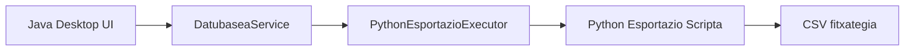

# Datu-baseko taulen esportazioa

Dokumentu honek *DIY Garajea* proiektuko **datu-baseko taulak CSV fitxategietara esportatzeko erabilera-kasua** azaltzen du.
Helburua da inplementatutako irtenbidea modu argi eta egituratuan azaltzea, erabaki arkitektonikoak eta fluxua ulertzeko moduan.

---

## 1. Ikuspegi orokorra

Datubaseko taulen esportazioaren kasuaren helburua da **MySQL datu-baseko taula bat CSV fitxategi batera esportatzea**, Desktop aplikaziotik abiatuta.

Kasu honetan, **Java eta Pythonen arteko erantzukizunen banaketa argia** ezartzen da:

- **Java** da erabilera-kasuaren orkestradorea:
  - Erabiltzailearen interakzioa kudeatzen du
  - Taulak zerrendatzen ditu
  - Python scriptaren exekuzioa abiarazten du
  - Exekuzioaren emaitza interpretatzen du
- **Python scripta** da lan teknikoaren **exekutatzailea**:
  - Datubasera konektatzen da
  - Taularen edukiak irakurtzen ditu
  - CSV fitxategia sortzen du
  - Irteera-kode baten bidez emaitza adierazten du
  
Bi inguruneen arteko komunikazioa irteera-kodeen (exit code) bidez egiten da soilik.
Ez da informaziorik trukatzen `stdout` edo `stderr`-en edukia analizatuz.

---

## 2. Erabilera-kasuaren fluxua

Erabilera-kasuaren exekuzio-fluxua honakoa da:

### 2.1 Taulen karga datu-basetik

- Desktop aplikazioak datu-basean dauden taulen zerrenda lortzen du.
- Horretarako, metadatuak erabiltzen dira, ez taulen edukiak:
  `DatubaseaService` → `DatubaseaMetaDAO` erabiltzen da

### 2.2 Taularen hautaketa

Erabiltzaileak esportatu nahi duen taula hautatzen du interfaze grafikoan.
Une honetan ez da esportaziorik egiten; hautaketa soilik erregistratzen da.

### 2.3 Python scriptaren exekuzio asinkronoa

Taula hautatu ondoren, erabiltzaileak *Esportatu* botoia sakatzen du, eta horrela Desktop aplikazioak Python scriptaren exekuzioa abiarazten du:

- Beste prozesu batean
- UI-a blokeatu gabe (Python scripta `SwingWorker` bidez exekutatzen da)
- Parametro minimoak pasatuz

### 2.4 Emaitzaren interpretazioa

Python scriptak amaitzean, Java aplikazioak irteera-kodea jasotzen du:

- 0: esportazioa ondo burutu da
- != 0: errore bat gertatu da

Ez da beste informaziorik aztertzen.

### 2.5 Erabiltzaileari erantzuna ematea

Azkenik, Desktop aplikazioak erabiltzaileari mezu argi bat erakusten dio:

- Arrakasta-mezua, esportazioa ondo joan bada
- Errore-mezua, bestela

---

## 3. Erabaki arkitektonikoak

Erabilera-kasu honetarako hartutako erabaki nagusiak hauek dira:

- **`DatubaseaService`** erabiltzen da **fatxada** gisa
  - Desktop aplikazioak ez du DAOekin zuzenean lan egiten.
  - **`DatubaseaMetaDAO`** erabiltzen da datu-baseko metadatuak lortzeko
(taulen izenak, egitura orokorra).
  - Domeinuko entitateetatik independentea da
- **`PythonEsportazioExecutor`** klasea
  - Python prozesuaren exekuzioaz arduratzen den osagaia da
  - `ProcessBuilder`-en erabilera kapsulatzen du
- **Irteera-fitxategien bideen kudeaketa ez da inoiz egiten Java-n.**
  - ez da UI-n edo zerbitzuan erabakitzen
  - Java-k ez daki non sortzen den CSV fitxategia
- **`data/datubasea` karpeta**:
  - repositoriotik kanpo dago (`.gitignore` bidez)
- **Komunikazio-arau zorrotza**:
  - `exit code` da komunikazio-bide bakarra
  - `stdout` / `stderr` es dira parseatzen
  
 Erabaki hauek guztiak proiektuaren garbitasuna, mantengarritasuna eta ikasgaitasuna indartzeko hartu dira.

---

## 4. Ibilbideen kudeaketa (Path)

Ibilbideen kudeaketa bi mailatan bereizten da, ardurak argi banatuz:

### Java aldean

- Java Desktop aplikazioak **JVM-aren exekuzio-direktorioa** erabiltzen du oinarri gisa:

```java
  System.getProperty("user.dir")
```

- Direktorio hori `garajea` proiektuaren erroarekin bat dator
- Hortik abiatuta, Java-k modu esplizituan eraikitzen ditu:
  - Python interpretearen bidea
    (`scripts/.venv/Scripts/python.exe`)
  - Esportazio-scriptaren bidea
    (`scripts/esportatu_taula.py`)
- Java-k **ez du erabakitzen**:
  - irteerako karpetarik
  - CSV fitxategien kokapena
- Java-k soilik pasatzen dizkio scriptari:
  - taularen izena
  - CSV fitxategiaren izen logikoa
  
### Python aldean

Python scriptak berak kudeatzen ditu bide guztiak:

- Python scriptak **bere burua kokatzen du**:

```python
  Path(__file__).resolve()
```

- Hortik abiatuta:
  - proiektuaren erroa kalkulatzen du
  - `data/datubasea` karpeta definitzen du
  - CSV fitxategiaren bide osoa eraikitzen du
- Banaketa honek honako abantailak ematen ditu:
  - *working directory*-arekiko independentzia
  - Proiektuaren egitura-aldaketen aurrean sendotasuna
  - Java eta Python proiektuen arteko koherentzia
  - `hardcoded` bideen eta mendekotasun inplizituen ezabapena
  
---

## 5. Fluxuaren diagrama sinplea

### Bloke-diagrama



Diagrama honek argi erakusten du kasuaren ibilbidea, arduren banaketa eta osagaien arteko harremana modu sinplean azalduz.
