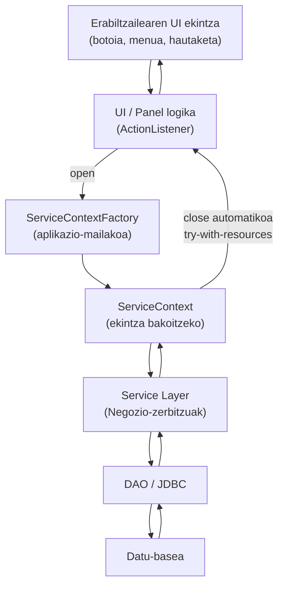
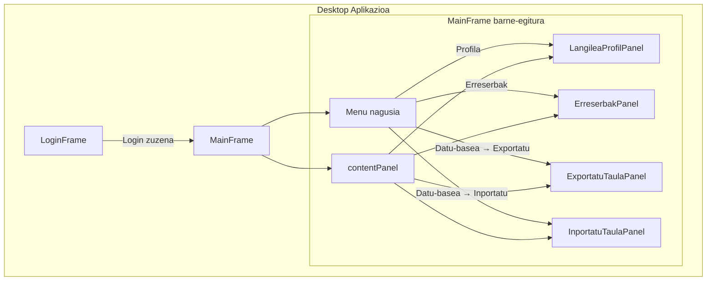

# MVC eredua – Desktop (Swing)

## 1. Helburua

Dokumentu honen helburua da DIY Garajea proiektuan
**desktop aplikazioan (Swing)** Model-View-Controller (MVC) eredua
nola aplikatzen den azaltzea.

Dokumentu hau **mvc-web.md** dokumentuaren osagarria da,
baina biak independenteak dira:

- MVC eredua bera da
- Inplementazioa eta exekuzio-ingurunea desberdinak dira

Helburua da:

- arduren banaketa argia mantentzea
- web eta desktop esparruak ez nahastea
- etorkizuneko hedapenak erraztea

---

## 2. Ikuspegia (View)

### 2.1 Teknologia

Desktop ikuspegia **Java Swing** teknologian oinarritzen da:

- `JFrame`
- `JPanel`
- `JButton`, `JLabel`, `JTextField`, ...
- `JTable`, `JList`

### 2.2 Ardura nagusiak

Bistaren ardura nagusiak hauek dira:

- Datuen bistaratzea
- Erabiltzailearen interakzioa jasotzea
- Errore-mezuen eta informazio-mezuen erakusketa

### 2.3 Murrizketak

Bistak **ez du**:

- negozio-logikarik
- zerbitzu-deirik zuzenean
- DAO edo ServiceContext erabilerarik

Ikuspegiak soilik **kontrolatzaileari** deitzen dio
UI ekintzen bidez.

---

## 3. Kontrolatzailea (Controller)

### 3.1 Kontzeptua

Desktop esparruan, kontrolatzailea:

- Swing event handler-en bidez inplementatzen da
- botoien ekintzak, aukerak edo form-en bidalketak kudeatzen ditu

Ez dago HTTP eskaerarik, baina **kontzeptua berdina da**:

- UI ekintza = web-eko HTTP request baten baliokidea

### 3.2 Ardura nagusiak

Kontrolatzailearen ardurak:

- Sarrera-datuen balidazioa
- ServiceContext irekitzea
- Negozio-zerbitzuak deitzea
- Emaitzen arabera ikuspegia eguneratzea

### 3.3 Zer ez duen egiten

Kontrolatzaileak **ez du**:

- negozio-arauik inplementatzen
- SQL kontsultarik exekutatzen
- datu-base konexiorik zuzenean kudeatzen

---

## 4. Zerbitzu-geruzarekiko integrazioa

Desktop aplikazioak web aplikazioaren
**zerbitzu-geruza bera** erabiltzen du (`garajea-core`).

### 4.1 ServiceContext erabilera

UI ekintza bakoitzean (adib. botoi baten klik-a),
ServiceContext bat irekitzen da:

```java
try (ServiceContext sc = serviceContextFactory.open()) {
    // Zerbitzu-deiak
}
```

Ezaugarriak:

- `ServiceContextFactory` → aplikazio-mailakoa
- `ServiceContext` → UI ekintza bakoitzeko
- `try-with-resources` eredua sistematikoki erabiltzen da

### 4.2  ServiceContext-en bizi-zikloa (ikuspegi bisuala)



#### ServiceContextFactory

- Aplikazioaren hasieran sortzen da (Desktop Bootstrap)
- Singleton moduan gordetzen da
- Ez da inoiz ixten aplikazioa martxan dagoen bitartean

#### ServiceContext

- UI ekintza bakoitzean sortzen da
- try-with-resources bidez ireki eta ixten da
- Bere barnean:

  - DAOFactory (DAO-ak eta JDBC konexioa)
  - KonfigurazioaService

- Bizi zikloa

  - UI ekintza → open()
  - Zerbitzu eta DAO deien exekuzioa
  - Bloketik irtetean → close() automatikoa
  - Baliabide guztiak behar bezala askatzen dira

Honek bermatzen du:

- Baliabide-kudeaketa segurua
- Transakzio-isolamendua
- Web aplikazioarekin koherentzia arkitektonikoa

### 4.2 Antzekotasuna web esparruarekin

Web aplikazioan:

- HTTP eskaera bakoitzeko ServiceContext bat

Desktop aplikazioan:

- UI ekintza bakoitzeko ServiceContext bat

Horrela, bi esparruek
**bizitza-ziklo berdina** partekatzen dute.

---

## 5. Errore-kudeaketa

Desktop aplikazioan errore-kudeaketa
kontrolatzaile mailan egiten da.

### 5.1 Negozio-erroreak

- `ZerbitzuSalbuespena`
- Negozio-arauak betetzen ez direnean jaurtitzen da

Kudeaketa:

- Erabiltzaileari mezua erakutsi (`JOptionPane`)
- Ez da stack trace-a bistaratzen

### 5.2 Errore teknikoak

Adibideak:

- `SQLException`
- `NullPointerException`
- Baliabideak ixteko erroreak

Kudeaketa:

- Log-ean erregistratu (Logback)
- Erabiltzaileari mezu generikoa erakutsi

---

## 6. Fluxu orokorra (Desktop MVC + Swing)

Desktop aplikazioko ekintza baten fluxu orokorra honakoa da:

```text
Erabiltzailearen ekintza
 └── Ikuspegia (Swing Panel)
       └── Kontrol-fluxua (UI ekintza)
             ├── Input balidazioa
             ├── ServiceContext.open()
             │     └── Zerbitzuak
             │           └── DAO
             └── Ikuspegiaren eguneraketa
```

Fluxu honek web aplikazioaren egitura bera jarraitzen du,
baina HTTP eskaeren ordez **Swing UIko ekintzak** (botoiak, menuak, hautaketak)
erabiltzen dira.

### 6.1 Frame eta Panel kontzeptuen arteko bereizketa

Desktop aplikazioan, MVC eredua Swing ingurunera egokituta aplikatzen da,
eta horretarako funtsezkoa da **Frame** eta **Panel** kontzeptuen arteko bereizketa argia.

#### Frame-ak (Leihoak)

Frame-ak aplikazioaren **egitura orokorra eta nabigazioa** antolatzeko erabiltzen dira.

Adib.: MainFrame

Frame baten ardura nagusiak hauek dira:

- Aplikazioaren leiho nagusia izatea
- Nabigazio maila altuko erabakiak hartzea
- Menu nagusia eta edukiontzi nagusia kudeatzea
- Leihoen bizi-zikloa kontrolatzea (setVisible, dispose, etab.)

Frame-ek ez dute:

- Negozio-logikarik
- Zerbitzu-deirik
- Datu-kargarik

#### Panel-ak (Ikuspegi funtzionalak)

Panel-ak dira aplikazioaren **eduki funtzionala** erakusten duten osagaiak.

Adib.: LoginPanel

Panel baten ardura nagusiak:

- Datuak bistaratzea (funtzionalite bakoitza kapsulatzen dute)
- Erabiltzailearen interakzioa kudeatzea
- Zerbitzuen geruzara (Service Layer-era) deiak egitea
- Bere edukia berritzea edo eguneratzea

Panel batek (proiektu honen arkitekturan):

- ServiceContext erabiltzen du
- Zerbitzuak ezagutzen ditu
- Baina ez du nabigazio orokorra kontrolatzen

### 6.2 contentPanel eredua: edukien trukaketa

MainFrame klasean, contentPanel izeneko JPanel bat erabiltzen da
ikuspegi desberdinak modu dinamikoan kargatzeko.

```java
private JPanel contentPanel;
```

Panel honek edukiontzi nagusiaren papera betetzen du:

- Aplikazioan beti presente dago
- Ez da berriro sortzen
- Bere barruko edukia bakarrik aldatzen da

Nabigazioa honela gauzatzen da:

```java
contentPanel.removeAll();
contentPanel.add(panelBerria, BorderLayout.CENTER);
contentPanel.revalidate();
contentPanel.repaint();
```

Eredu honek aukera ematen du:

- Menu nagusia eta leihoa egonkorrak izateko
- Ikuspegiak (Panel-ak) modu sinplean trukatzeko
- CardLayout bezalako mekanismo konplexuak saihesteko

Hezkuntza-arloan eta aplikazioaren tamaina kontuan hartuta,
eredu hau argia, sinplea eta mantengarria da.

### 6.3 Frame ↔ Panel harremana (Desktop MVC)



#### Frame-ak (JFrame)

LoginFrame: saio-hasierako leihoa
MainFrame: aplikazioaren leiho nagusia

#### MainFrame

- Menu nagusia dauka (JMenuBar)
- contentPanel edukiontzia dauka, non panelak txandakatzen diren

#### Panel-ak (JPanel)

- ProfilPanel: Langilearen profilari buruzko funtzionalitatea
- ErreserbakPanel: Erreserbei buruzko funtzionalitatea (adib. errsserba-listak erakustea)
- ExportatuPanel: datu-baseko taula bat fitxategi batera exportatzeko funtzionalitatea
- InportatuPanel: fitxategi baten edukia datu-baseko taula batera inportatzeko funtzionalitatea

#### Nabigazioa

Menuaren bidez egiten da. contentPanel barruko edukia kudeatu egiten da,
dagokion panela bertan kargatuz.

### 6.4 Ondorio arkitektonikoa

DIY Garajea proiektuaren desktop aplikazioan:

- Frame-ek aplikazioaren egitura eta nabigazioa antolatzen dute
- Panel-ek funtzionalitatea eta interakzioa kapsulatzen dute
- MVC eredua Swing ingurunera egokituta aplikatzen da

Web aplikazioarekin koherentzia kontzeptuala mantentzen da,
baina exekuzio-ingurunearen berezitasunak errespetatuz

Arkitektura honek bermatzen du:

- Kodearen antolaketa argia
- Etorkizuneko funtzionalitateen integrazio erraza
- Mantengarritasuna

---

## 7. Laburpena

DIY Garajea proiektuan desktop aplikazioak:

- MVC eredua errespetatzen du
- Web aplikazioaren zerbitzu-geruza bera erabiltzen du
- UI eta kontrol-fluxu propioa du

Honek aukera ematen du:

- arkitektura koherente bat mantentzeko
- web eta desktop arloak independente garatzeko
- etorkizuneko funtzionalitate berriak modu garbian gehitzeko
