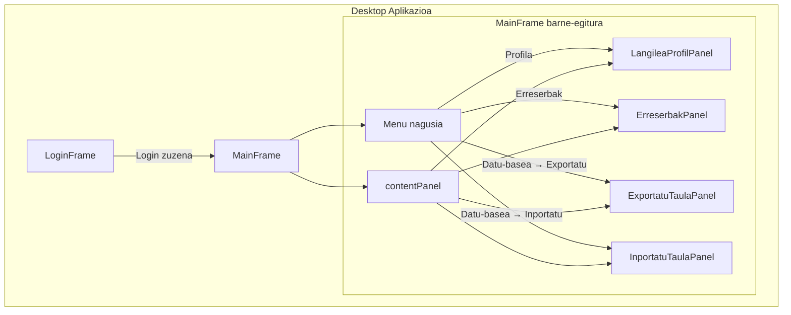
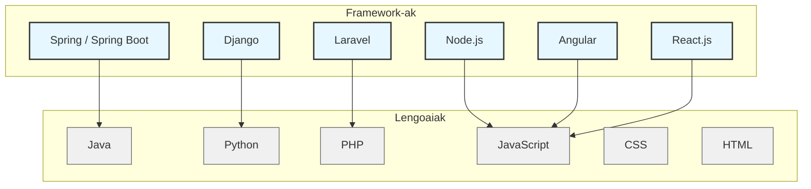

# DIY Garajea: Tailer Mekanikoaren Kudeaketa Sistema - Dokumentazio Laburtua

DIY Garajearen proiektua, tailer mekaniko baterako kudeaketa sistema
informatikoa da.
Sistemak bi alde nagusi ditu: Web aplikazioa eta Desktop aplikazioa.

Proiektuaren kodea eta dokumentazioa Github-eko helbide honetan dago
eskuragarri:
[DIY Garajea proiektua GitHub-en](https://github.com/lopezibon-dev/garajea)

Bereziki, dokumentazioarekin hasteko, eta proiektu honetan landutako
gaietan sakontzeko:

- [Proiektuko README](https://github.com/lopezibon-dev/garajea/blob/main/README.md)
- [Arkitektura-dokumentuen
README](https://github.com/lopezibon-dev/garajea/blob/main/docs/arkitektura/README.md)
Dokumentu honetan proiektuko karpeten mapa bat aurkitu daiteke (2.
atalan: Proiektuaren Egituraren Mapa), argitzeko zein karpetetan
kokatzen den proiektuaren arkitekturako logika bakoitza.

## Erabilitako teknologiak eta tresnak

- Programazio-lengoaiak: Java 25, Python 3.14
- Apache Maven: 3.9.11 bertsioa; proiektuaren azpiegituraren
kudeatzailea (dependentziak, konpilazioa, enpaketatzea)
- Datu-base sistema: MySQL 8.0.41
- Apache Tomcat: 11.0.13 bertsioa (zerbitzaria, Java web aplikazioak egikaritzeko)
- Web Teknologiak:
  - HTMl eta CSS (web responsive diseinua jarraituz)
  - Java Servlets (Jakarta bertsioa)
  - Filtroak
  - JSP
  - JSTL
  - Expression Language
- Desktop Teknologiak
  - Swing
- IDE: Visual Studio Code. VS Code extentsio lagungarriak:
  - Extension Pack for Java:  honek hainbat extentsio batera
instalatzen ditu: Language support for Java(TM) by Red Hat, Debugger
for Java, Test Runner for Java, Maven for Java, Gradle for Java,
Project Manager for Java
  - Community Server Connectors: VS Code Tomcat-ekin lan egiteko
  - Python (Microsoft). Extentsio pack honek Python-ekin lan egiteko
zenbait extentsio instalatzen ditu: Pylance, Python Debugger, Python
Environments
- DBeaver: 25.3.0. Datu-baseen kudeaketa egiteko (PHPMyAdmin ere
lagungarria da, XAMPP instalatuta izanez gero)

## Sistemaren arkitektura

- Sistema hau hezkuntza-proiektua da, aplikazioen arkitektura lantzeko sortua.
- Ez da produktu komertzial bat.
- Helburua da diseinu garbia, koherentzia eta geruzen arteko
bereizketa zorrotza.

Geruzen arteko bereizketa zorrotz hori, SRP deritzon printzipioan datza: Single-Responsability Principle.
Printzipio honek dio edozein modulu, klase, funtzio, erantzukizun bakarra izan behar duela.

Sistema hainbat modulutan banatua dago:

- garajea-web modulua (Modulu honek Bista eta Kontrolatzaile logika ditu,
web esparruan erabiliak; Core modulua erabili beharra du)
- garajea-desktop modulua (Modulu honek Bista eta Kontrolatzaile logika
ditu, desktop esparruan erabiliak; Core modulua erabili beharra du)

Biek partekatzen dute:

- garajea-core modulua (Zerbitzuak: negozio-logika; Model modulua erabili beharra du)
- garajea-model modulua (entitateak + DAO)

Ez da onartzen dependentzia-saltorik. Hau da, kontrolatzaile logikan ez dago DAOen edota datu-baseari buruzko erreferentziarik

## Web aplikazioko fluxu orokorra

HTTP eskaera baten prozesamenduaren fluxu orokorra honakoa da:

1. Nabigatzailea → Controller
2. Controller → ServiceContextFactory
3. ServiceContext → Zerbitzuak
4. Zerbitzuak → DAO
5. DAO → Datu-basea
6. Emaitza → Controller
7. Controller → Bista (JSP)

## Desktop aplikazioko fluxu orokorra

```text
Erabiltzailearen ekintza
 └── Bista (Swing Panel)
       └── Kontrol-fluxua (UI ekintza)
             ├── Input balidazioa
             ├── ServiceContext.open()
             │     └── Zerbitzuak
             │           └── DAO
             └── Bistaren eguneraketa
```

### Frame ↔ Panel harremana (Desktop aplikazioa)



Desktop aplikazioko Panel/Bista bakoitzean, logika honela banatzen eta gauzatzen da:

1. Panela (Bista) osatu: bere osagaiak ipini interfazean (initUI).
2. Datuak kargatu/gorde: hemen dago kontrolatzaile logika, zerbitzuekin komunikatuko dena.
3. Datuak edota mezu bat bistaratu: datuak kargatuz gero, bistan txertatu datu horiek; edota datuak gorde ondoren, mezu bat erakutsi.

## Java eta Python "batera" lantzen

- [Datubasea - Taula esportatu](https://github.com/lopezibon-dev/garajea/blob/main/docs/arkitektura/datubasea-taulen-esportazioa-kasua.md)
- [Datubasea - Taula inportatu](https://github.com/lopezibon-dev/garajea/blob/main/docs/arkitektura/datubasea-taulen-inportazioa-kasua.md)

SwingWorker eta ProcessBuilder Javako teknologiak erabiliz.

## Python

Zenbait script landu ditut, karpeta honetan daudenak:
[Python script-ak](https://github.com/lopezibon-dev/garajea/tree/main/scripts)

Script baten adibidea:

### Erreserba estatistiken txostenak

Python-en bidez, urte bateko erreserben estatistiken txostenak sortzeko: datu‑baseko datuetatik abiatuta HTML, CSV eta Markdown (MD) formatuko txostenak sortzea da helburua, eta bidean XML eta XSL orriak erabiliz.
[Erreserba estatistiken txostenak - Dokumentazioa](erreserba_estatistiken_txostenak_dokumentazioa.md)

## 3. ebaluazioan lantzeko

- JQuery Javascript liburutegia erabili DIY Garajeko web aplikazioan
- Python-en objektuak landu: fitxategi batean objektuak gorde
- PHP-rekin "zeozer" egin
- Agian, Spring (eta Spring Boot) edota Django framework-etan murgildu ikusteko nola automatizatu landutako zenbait kontzeptu:
  - Persistentzia (behintzat DAO-etan erabilitako CRUD eragiketak)
  - Erroreen tratamendua
  - Logging (log batean idatzi gertakizunak: erroreak, informazioa, ...)
  - Aplikazioen bootstrap (hasieraketa)
  - Transakzio-erako eragiketak
  - Autentifikazioa eta sesioen kudeaketa
  - DTO: informazioa alde batetik bestera mugitzeko (entitateen objektuen ordez)

## Framework-ak eta lengoaiak


