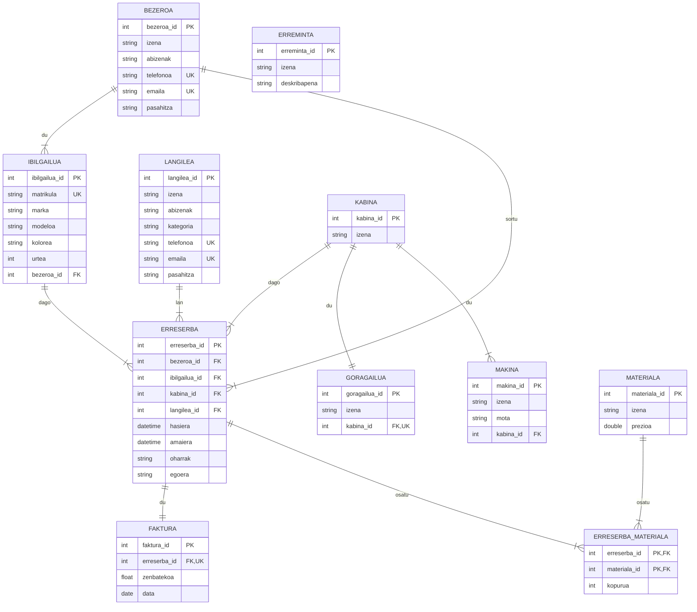

# DIY Garajea – Entitateen eta Erlazioen Diagrama (ERD)

```mermaid
erDiagram
    BEZEROA {
      int bezeroa_id PK
      string izena
      string abizenak
      string telefonoa UK
      string emaila UK
      string pasahitza
    }
    IBILGAILUA {
      int ibilgailua_id PK
      string matrikula UK
      string marka
      string modeloa
      string kolorea
      int urtea
      int bezeroa_id FK
    }
    LANGILEA {
      int langilea_id PK
      string izena
      string abizenak
      string kategoria
      string telefonoa UK
      string emaila UK
      string pasahitza
    }
    KABINA {
      int kabina_id PK
      string izena
    }
    GORAGAILUA {
      int goragailua_id PK
      string izena
      int kabina_id FK, UK
    }
    ERRESERBA {
      int erreserba_id PK
      int bezeroa_id FK
      int ibilgailua_id FK
      int kabina_id FK
      int langilea_id FK
      datetime hasiera
      datetime amaiera
      string oharrak
      string egoera
    }
    FAKTURA {
      int faktura_id PK
      int erreserba_id FK, UK
      float zenbatekoa
      date data
    }
    ERREMINTA {
      int erreminta_id PK
      string izena
      string deskribapena
    }
    MAKINA {
      int makina_id PK
      string izena
      string mota
      int kabina_id FK
    }
    MATERIALA {
      int materiala_id PK
      string izena
      double prezioa
    }
    ERRESERBA_MATERIALA {
      int erreserba_id PK, FK
      int materiala_id PK, FK
      int kopurua
    }

    BEZEROA ||--|{ IBILGAILUA : "du"
    BEZEROA ||--|{ ERRESERBA : "sortu"
    IBILGAILUA ||--|{ ERRESERBA : "dago"
    KABINA ||--|{ ERRESERBA : "dago"
    LANGILEA ||--|{ ERRESERBA : "lan"
    ERRESERBA ||--|| FAKTURA : "du"
    ERRESERBA ||--|{ ERRESERBA_MATERIALA : "osatu"
    MATERIALA ||--|{ ERRESERBA_MATERIALA : "osatu"
    KABINA ||--|| GORAGAILUA : "du"
    KABINA ||--|{ MAKINA : "du"
```
