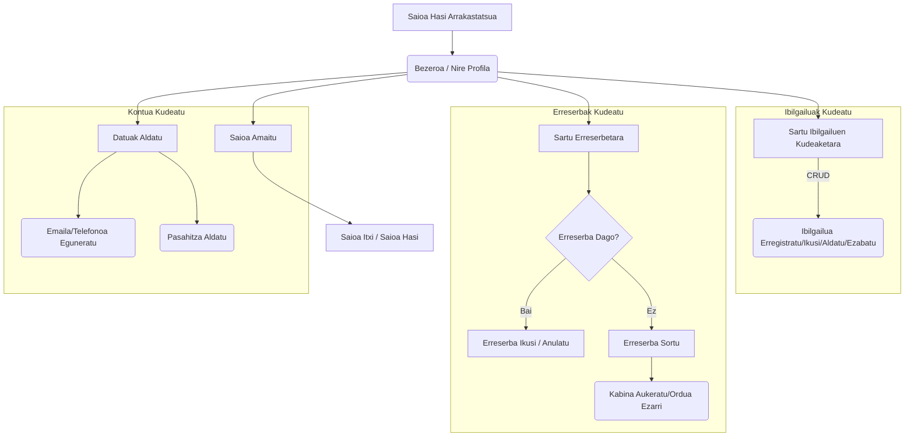

```mermaid
---
config:
  layout: fixed
---
graph TD
    A[Saioa Hasi Arrakastatsua] --> B(Bezeroa / Nire Profila);

    subgraph Ibilgailuak Kudeatu
        V1[Sartu Ibilgailuen Kudeaketara] -- CRUD --> V2(Ibilgailua Erregistratu/Ikusi/Aldatu/Ezabatu);
    end

    subgraph Erreserbak Kudeatu
        R1[Sartu Erreserbetara] --> R2{Erreserba Dago?};
        R2 -- Bai --> R3[Erreserba Ikusi / Anulatu];
        R2 -- Ez --> R4[Erreserba Sortu];
        R4 --> R5(Kabina Aukeratu/Ordua Ezarri);
    end

    subgraph Kontua Kudeatu
        K1[Datuak Aldatu] --> K2(Emaila/Telefonoa Eguneratu);
        K1 --> K3(Pasahitza Aldatu);
        K4[Saioa Amaitu];
    end

    B --> K1;
    B --> V1;
    B --> R1;
    B --> K4;
    
    K4 --> E[Saioa Itxi / Saioa Hasi];
```    